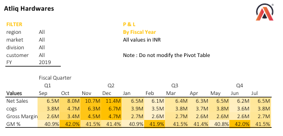

# 📊 Business Performance Analytics using Microsoft Excel

> **An end-to-end Business Intelligence project built in Microsoft Excel to transform raw sales and financial data into interactive dashboards and actionable business insights using Power Query, Power Pivot, and DAX.**

---

## 📌 Project Overview

This project demonstrates how Microsoft Excel can be leveraged as a Business Intelligence tool to analyze sales and financial data. Using **Power Query** for data transformation, **Power Pivot** for data modeling, and **DAX** for KPI calculations, the project delivers interactive dashboards that enable stakeholders to monitor customer performance, evaluate market trends, and analyze business profitability.

---

## ⭐ Project Highlights

- 📊 5 Interactive Business Reports
- 👥 Customer Performance Analysis
- 🌍 Market Performance vs Sales Target
- 💰 Profit & Loss Analysis by Fiscal Year, Month & Market
- ⚙️ Automated ETL using Power Query
- 🔗 Relational Data Modeling with Power Pivot
- 📐 KPI Development using DAX
- 📈 Interactive Dashboards using Pivot Tables & Slicers

---

## 🛠 Tools & Technologies

- Microsoft Excel
- Power Query
- Power Pivot
- DAX (Data Analysis Expressions)
- Pivot Tables
- Pivot Charts
- Slicers

---

# 📊 Dashboard Reports

## 👥 Customer Performance Report
📄 **[View Customer Performance Report (PDF)](Reports/Customer%20Performance%20Report.pdf)**

  

Analyzes customer-wise sales performance across multiple fiscal years, helping identify high-performing customers, evaluate revenue contribution, and monitor year-over-year growth.

---

## 🌍 Market Performance vs Target
📄 **[View Market Performance vs Target Report (PDF)](Reports/Market%20Performance%20vs%20Target.pdf)**

  

Compares actual sales against predefined targets across various markets, enabling users to identify performance gaps and evaluate target achievement.

---

## 💰 Profit & Loss Statement by Fiscal Year
📄 **[View P&L Statement by Fiscal Year (PDF)](Reports/P%26L%20Statement%20by%20Fiscal%20Year.pdf)**

  

Provides a yearly financial overview by analyzing Net Sales, Cost of Goods Sold (COGS), Gross Margin, Gross Margin %, and Year-over-Year growth.

---

## 📅 Profit & Loss Statement by Month
📄 **[View P&L Statement by Month (PDF)](Reports/P%26L%20Statement%20by%20Months.pdf)**

  

Tracks monthly and quarterly financial performance to identify seasonal trends, revenue fluctuations, and profitability patterns.

---

## 🌎 Profit & Loss Statement by Market
📄 **[View P&L Statement by Market (PDF)](Reports/P%26L%20Statement%20by%20Markets.pdf)**

  

Compares profitability across different markets using Net Sales, Gross Margin, and Gross Margin %, supporting market-level performance analysis.

---

## 💡 Business Insights

- Identified top-performing customers contributing significantly to overall revenue.
- Compared market performance against business targets to identify performance gaps.
- Evaluated profitability using Gross Margin and Gross Margin %.
- Analyzed financial performance across fiscal years, months, and markets.
- Enabled interactive reporting to support data-driven business decisions.

---

## 🚀 Skills Demonstrated

- Business Intelligence
- Financial Analysis
- Sales Analytics
- Data Cleaning & Transformation
- Data Modeling
- KPI Development
- Dashboard Design
- DAX
- Power Query
- Power Pivot
- Data Visualization

---

## 📖 Detailed Project Documentation

For a comprehensive explanation of the project methodology, workflow, KPI development, and dashboard design, please refer to the **[PROJECT_DOCUMENTATION.md](PROJECT_DOCUMENTATION.md)** file.

---

## 👩‍💼 About Me

**Tanvi Badmanji**

**MBA (Finance) | Financial Analyst**

📧 **tanvibadmanji@gmail.com**

🔗 **LinkedIn:** *(https://www.linkedin.com/in/tanvi-badmanji)*

⭐ *Thank you for visiting my repository! Feel free to explore my other analytics projects and connect with me.*
